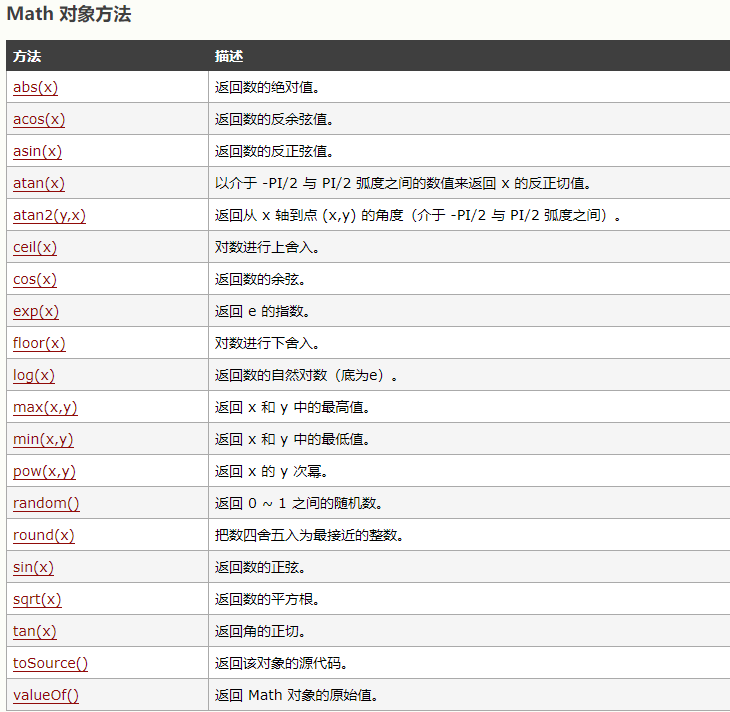
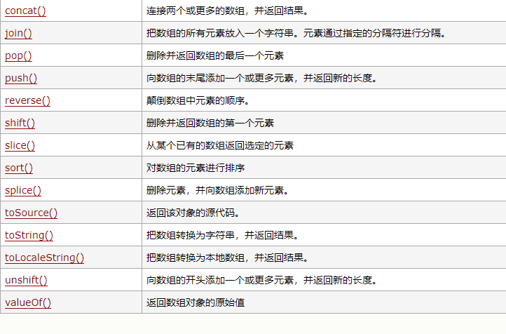

# JS

## 方式

+ 在<script/script>中书写;
+ 分为两种写入方式;
+ 1.内嵌式{在html中写入}测试常用;
+ 2.外链式{src:"xxxx.js"}开发常用
+ 3.每一个脚本后都要以分号;结尾，分号结尾是用于JS解析器用。

## 输出方式

+ alert()  在括号里写入内容兵在文字前后加入引号,打开网页后会出现一个弹窗,一帮用于调试时使用,
+ console.log() 在括号里输入声明后的值,也可以输入文字,数字等,在浏览器的调试中查看,调试代码常用
+ confirm() 在括号里输入文字,在浏览器中以确定或取消的选择框出现,代表trye/flase 不常用
+ prompt() 在括号里写进文字,在浏览器中会出现一个输入框,可以输入文字等,在输入文字后加入,可以显示在输入框中,不代表任何意思
+ document.write() 在浏览器界面显示写入的文字,不常用
  
## 转义字符

+ \”转双引
+ \’转单引
+ \n转换行
+ \r 转回车

## 变量

+ var 后面的名称可以任意取名,但在var后面不能加汉字和数字,这样声明的是不被读取的,关键性词汇也是不行的比如'left','red'等,如果声明的是英文要注意大小写,开头第一个英文是小写的,在后面的另一个单词一个字母用大写剩余的还是小写(这是驼峰命名法).
+ var str = 10;  正确写法
+ var Str = 10:  错误
+ var 123 = 10;  错误
+ var 变量 =  10; 错误

## 基本数据类型

+ number 数字类型 1,23,555,8998999  var age = 100;打印后是number

+ string 字符串 汉字,英文 var str ='今天不错' 打印后出现的是string

+ boolean 布尔数据  后面写true或false 打印后是boolean;
  
   {var sex = true; 打印后是true;
   var sex = false 打印后是false;
  
+ undefined    变量未初始化,报错

+ null 变量没有被引用,无效

### 判断数据类型

+ typeof  
  
```
var age = '你好'
  console.log(typeof age);
  打印出来后是 String
  所以说age是字符串类型的变量,同理其他类型

```

### 比较运算符

```

1=1 在数学中是正确的,但在程序中会出错
1 == 1   true
1 > 1    flase
1> -1    true
1 >= -1  true
1 < -1   flase
1 != 2   true

```

### 算数运算符


➕
两个数字类型相加得到数字类型 num + num ==> num
一个数字和字符串相加得到字符创 num + str ==> str(拼接位字符串)

-
num-字符串类型的数字 ==> number
字符串类型number - 字符串类型number ==> number

➗
 两个数字类型的变量相除，得到的是一个数字类型。
 一个数字类型和一个数字字符串相除，得到的是一个数字类型。
 一个数字类型和一个非数字字符串相除，得到的是NaN,是一个数字类型。
 0做为除数的时候，得到结果Infinity （无限大），是一个数字类型。

％ 取余数
10/4 = 2 
```
+= 

var a = 10;
var b = 3;
b += a;
console.log(b);
b==>13
意思是在b的基础上加了一个a;
```

```
a++

var a = 1;

var b = a;

a++ 先使用a,再++ 

var b = a++;

先执行++,再使用a

var b = ++a;

console.log(a); // 2   2

console.log(b); // 1   2

 a++ 是先参与使用,后++
 ++a  是先执行++,再参与使用
```

### JS内置对象

```
 Date  日期对象 用于获取年月日时分秒

 new是面向对象才能解释的东西,这里就记下来. 	var date = new Date();  // 程序获取的是北京时间

 js内置对象的API  applition  progrom  interface

 console.log(date);

 根据date对象获取年份
 var year = date.getFullYear();

 var month = date.getMonth()+1; // 0~11 

 var day = date.getDate();

 var hour = date.getHours();

 var min = date.getMinutes();

 var sec = date.getSeconds();

 document.write(year+'年'+month+'月'+day+'日 '+hour+':'+min+':'+sec);

console.log('date.getYear===>'+date.getYear())

console.log('date.getDay===>'+date.getDay());

```

### Math对象

``` 
天花板函数Math.ceil,对数字不进行四舍五入直接向上取整.
Math.ceil(2.3)  /取3
Math.ceil(-2.1)  /取-2
```

```
地板函数Math.floor,向下取整,同样不进行四舍五入,直接取整
Math.floor(-2.5)  /取-3
Math.floor(2.5)  /取2
```

```
求最大值 Math.max 取数组中最大的数字
Math.max(12,5,8,9,8,)  / 取9
```

```
求最小值 Math.min 求一个数组中的最小值
Math.min(1,2,5,8,6,7,69)  / 取1
```

```
伪随机 Math.random()  去一个随机数范围在0~1之间,括号后面添加数量

生成一个x-y之间的随机数
Math.round(Math.random()*(x-y)+x)

Math.random()*5  取一到五之间的随机数,包含小数点,可以使用地板函数和天花板函数取整.

console.log(Math.ceil(Math.random()*?));  向上取整随机数
```

```
Math.floor(Math.random() *数量+ min)
15-31之间随机值:console.log(Math.floor(Math.random()*17+15));
console.log(Math.ceil(Math.random()*?));  向下取整随机数
```

```
返回一个数的次方:Math.pow(X,Y) X是想要想要求次方的数,Y是要求多少次方
Math.pow(3,5) 三的五次方 243
Math.round(x)  把一个数字舍入为最接近的整数。
Math.round(2.5) / 3
Math.round(2.5555555555)  / 3
回去离X最接近的数字,会把小数直接取整,取最近的值,造成误差
```

+ 更多方法
  

### 逻辑运算符

```
参与逻辑计算的都是布尔值,得到的答案也是布尔值

&&  与/切 ,当两个都为真时则为真,有一个是假就是假

||  或  两个函数中有一个为真就是真,两个都是假的就是假

!  非  取反

>	大于号
<	小于号
>= 	大于或等于
<=  小于或等于
== 	等于
=== 全等于  首先对比类型，在对比值  在js中  比较一般使用 === 
!=	不等于
!== 不全等于
```


### IF语句

+ IF语句可以被称为条件判断语句,条件表达式,只有两种选择,不是true就是flase,给程序一个选择的判断

+ 公式
  
```
if(条件){
  条件为真的是做的事
}else{
  条件为否的做的事
}

```
+ 多分支表达式

```

1.if(条件表达式1){
2.	条件1为真的时候做的时候
3.}else if(条件表达式2){
4.	条件1不满足，条件2满足的时候做的事情
5.}else if(条件表达式3){
6.	条件1、2不满足，条件3满足的时候做的事情
7.}else{
8.	全都不满足的时候做的事情
}

```

### 三元运算符

+ 语法:表达式?如果表达式结果为true执行这里的代码:如果表达式结果为false执行冒号后面的代码;
+ 例子: step = step>1?1:-1;   


### SWITCH语句

+ 用法:Switch语句后面的变量数据类型必须和case后面的数据类型保持一致。适合比较少的种类判断，而且我们知道多少种。

+ 语句: 
 ```
switch(变量N){
   case X
   执行的代码(console.log;alert)
   break;
   case Y
   执行的代码(console.log;alert)
   break;
}

```

### 自增自减

+ var i  = 10;
  var a = i++; console.log(a); a= 10;
  var b = ++i  console.log(b); b= 11;

+ 原理:i++,i先参与运算,在执行++
       ++i, ++先执行,在参与运算

### while语句

```

var num = 1;

while (num < 100) {
  	console.log('num==>',num);
			num ++ ;
		}
这会打印1~100之间的数字
```

### for循环

```

语句写法:for(var i= 1 ; i<10;i++){}
 执行顺序：
 ◆首先进行变量初始化，并进行条件判断
 ◆如果条件结果为true，那么执行循环体内的代码，然后执行 i++;
 ◆判断条件是否为true,继续执行循环体内代码。否则跳出循环;
     for(var i= 1;i<10;i++){
        if(i>5){
            console.log('第一次',i);
        }else if(i<5){
            console.log('第二次',i);
        }
     }
判断i>5时,打印出大于5的数字,如果不大于五,那就打印出小于5的数字

```

#### break语句

+ 在循环体内,只要遇到break,就立即终止循环,后面的代码也不会执行.

#### continue语句

+ 指的是跳出本次循环,后面的代码不会执行

## 函数

+ 函数也是一个对象
  
+ 函数中可以封装一些功能(代码),在需要时可以执行这些代码
  
+ 函数中可以保存一些代码在需要的时候调用
  
+ 封装到函数中的代码不会立即执行
  
+ 函数中的代码会在函数调用时执行
  
+ 调用函数的语法:函数对象()
  
+ 当调用函数时,函数中封装的代码会按照顺序执行
  
+ 使用函数声明来创建一个函数
  
+ 语法:function 函数名 (形参){
       语句...
  }
+ 可以在函数的()中来指定一个或多个形参
  
+ 多个形参之间使用,隔开.声明形参就相当于函数内部声明了对应的变量 
   
+ 在调用函数时,可以在()中指定实参(实际参数)
  
+ 实参将会赋值给函数中对应的函数
  

```

function sum(a,b){
  console.log(a+b);
}
sum(1,2);
```

+ 调用函数时解析器不会检查实参的类型
  
+ 要注意是否有可能会接收到非法的参数,如果有则需要对参数进行类型的检查
  
+ 函数的实参可以是任意的数据类型
  
+ 解析器不会检查实参的数量
  
+ 多余的实参不会被赋值
  
+ 如果实参的数量少于形参的数量,则没有对应的实参的形参是undefined
  
#### 返回值

+ 可以使用return 来设置函数的返回值
+ 语法:
+ return 值
  
+ return后的值将会作为函数的执行结果返回
  
+ 在函数中return后的语句都不在执行
  
+ 如果return语句后不跟任何值就相当于返回一个undefined
  
+ return后可以跟任意类型的值
  
+ 变量result的值就是函数的返回结果

``` 

function sum(a,b,c){
  var d= a + b + c;
 
  return d;
}

var result = sum(4,7,8);
console.log(result);

```

+ 实参可以是一个对象,也可以是一个返回值 
  
+ 返回值可以是任意类型,可以his一个函数,也可以是一个对象
  
+ 函数也可以称为对象的属性
  
+ 如果一个函数作为一个对象的属性保存,那么我们称这个函数时这个对象的方法调用这个函数就说调用函数的方法(method)
  
+ 只是名称上的区别

+ 枚举对象中的属性
  
+ 使用for....in语句
  
+ 语法:for(var 变量 in 对象){}
  
+ for...in语句对象中有几个属性,循环体就会执行几次,每次执行时,会将对象中的一个属性的名字赋值给变量
  

### 全局作用域

+ 作用域指一个变量的作用的范围
  
+ 在JS中作用域有两种作用域
  
+ 1.全局作用域
  
+ 直接编写在script标签中的JS代码,都在全局作用域,全局作用域在页面打开时创建,在页面关闭时销毁,在全局作用域中有一个全局对象window,它代表的是一个浏览器窗口,他又浏览器创建我们可以直接使用
  
+ 在全局作用域中,创建的变量都会作为window对象的属性保存,创建的函数都会作为window对象的方法保存

##### 变量的声明提前

+ 使用var关键字声明的变量,会在所有的代码执行前被声明
  
+ 但是如果声明变量不适用var关键字,则变量不会被声明提前

##### 函数的声明提前

+ 使用函数声明形式创建的函数他会在所以得代码执行前被创建,所以我们可以在声明前来调用函数
  
+ 使用函数表达式创建的函数,不会被声明提前,所以不能在声明前调用
  
+ 全局作用域中的变量都是全局变量,在页面的任意部分都可以访问到
  
### 函数作用域

+ 调用函数时创建函数作用域,函数执行完毕后,函数作用域销毁,每调用一次函数就会创建一个函数作用域,他们之间是互相独立的
  
+ 在函数作用域中可以访问到全局的变量,在全局作用域中无法访问到函数作用域的变量
  
+ 当在函数作用域操作一个变量时,他会现在自身作用域中寻找,如果有就直接使用,没有就去上一级作用域中寻找,直到找到全局作用域,要是仍然没有就报错
  
```

 var a = 10;

    function fun () {
   
        var a = "这是慎m";

        var b = 20;

        // console.log(a);

        function fun2() {
            console.log(a);
        }
        fun2();
    }
    fun();
    console.log('a=',a);

```

+ 在函数中访问全局作用域就用window
  
+ 在函数作用域中也有声明提前,使用var关键字声明的变量,会在函数中所有的代码执行前被声明,函数声明也会在函数中所有的代码之前执行
  
+ 在函数中,不适用var声明的变量都会成为全局变量
  
+ 定义形参就相当于在函数的作用域中声明了变量

#### this

+ 解析器在调用函数每次都会想函数内部传递一个隐含的参数,这个隐含的参数就是this,this指向的是一个对象,这个对象称为函数的上下文对象,根据函数的调用方式不同,this会指向不同的对象
  
+ 1.以函数的形式调用时,this永远是window
+ 2.以方法的形式调用时,this是就是调用方法的哪个对象
  
 ```
    var name = "全局";

        function fun() {
            console.log(this.name);
        }
        var obj = {
            name: "孙悟空",
            sayName: fun
        };
        var obj2 = {
            name: "猪八戒",
            sayName: fun
        };
        obj.sayName();
        obj2.sayName();
```

#### toString()

+ 直接在页面中打印一个对象时,事件上是输出的对象的toString()方法的返回值,如果我们希望在输出对象时不输出[object,object],可以为对象添加一个toString()方法

#### 垃圾回收

+ 当一个对象没有任何的变量或属性对它进行引用,此时我们将永远无法操作该对象,此时这种对象就是一个垃圾,这种对象过多会占用大量的内存空间,导致程序运行变慢,所以这种垃圾必须清理
  
+ 在JS中拥有自动的垃圾回收机制,会自动将这些垃圾对象从内存中销毁,我们不需要也不能进行垃圾回收的操作
 
+ 我们需要做的只是要将不再使用的对象设置null即可

### 函数对象方法(补充)

+ call()和apply()
  
> 1.这两个方法都输函数对象的方法,需要通过函数对象来调用
>> 2.当对函数对象调用call()和apply()都会调用函数执行
>>> 3.在调用call()和apply()可以将一个对象指定为第一个参数
>>>> 4.此时这个对象将成为函数执行时的this
>>>>> 5. call()方法可以将实参在对象之后一次传递
>>>>>> 6. apply()方法需要将实参封装到一个数组中统一传递

+ this的情况
  
> 1. 以函数形式调用时,this永远都是window
> 2. 以方法的形式调用时,this时调用方法的对象
> 3. 以构造函数的形式调用时,this时新创建的那个对象
> 4. 使用call()和apply()调用时,this是哪个对象

## 数组(Array)

+ 数组也是一个对象,和我们普通对象功能类似,也是用来存储一些值的,不同的是普通对象是使用字符串作为属性名的,而数组是使用数字来作为索引操作元素
  
+ 索引从0开始的整数就是索引(index);
  
+ 数组的存储性嫩比普通对象好,在开发中我们经常使用数组来存储一些数据
  
+ 通过对象形式创建数组 var arr  = new.Array[].
  
+ 直接创建新的数组   var arr = [12,15,20,63];
  
+ 向数组中添加元素
 语法:数组[索引] = 值
+ 读取数组中的元素
 语法:数组[索引],如果读取不存在的索引,不会报错会返回undefined;

+ 获取数组中的长度,可以通过length属性来获取数组的长度(元素的个数)
   语法:数组.length

+ 对于连续的数组,使用length可以获取到数组的长度(元素的个数) 
  
+ 对于非连续性的数组,使用length会获取到最大的索引+1;,尽量不要创建非连续性数组
  
+ 如果修改的length大于原长度,则多出部分会空出来
  
+ 如果修改的length小于原长度,则多出部分会被删除
  
+ 向数组的最后一个位置添加元素,语法: 数组[数组.length] = 值
  

### 数组的赋值

+ 数组通过下标的方式进行赋值,下标从0开始.(同上) arr[0]:12 arr的第零个坐标就是12.
  
+ 属性:获取数组中元素的个数 console.log(arr.length);  /4 该数组的长度是4.

+ 数组的合并concat()

```
var arr = [1,2,3];
var arr2 = [4,5,6];
var arr3 = arr.concat(arr2);

console.log(arr);

console.log(arr3); [1,2,3,4,5,6];

```

 数组的转换join()把数组转换为字符串
  
```

var arr4 = ['a','b','c'];
console.log(arr4.join('-')); 转换后a-b-c,转换前是a,b,c

```

+ 把字符串转换为数组split(),把一个字符串分割成字符串数组

```

var str = 'it is a fineday today';
var arr5 = str.split(' ');
console.log(arr5);
转换前:  it is a fineday today
转换后: ["it", "is", "a", "fineday", "today"]
```

+ 数组常见的方法

```

var arr = [1,2,3];

1. push()  可以想数组的末尾添加一个或多个元素,并返回数组的长度

2. unshift()  从数组的前面放入

3. pop()    删除最后一个元素

4. shift()   删除第一个元素

   arr.push(4);
   arr.push(5);
   arr.unshift(0);
   console.log(arr); [0,1,2,3,4,5];
   arr.pop();
   console.log(arr); [0,1,2,3,4];
   arr.shift();
   console.log(arr);  [1,2,3,4];

   <更多属性参考下面>
```

+ 常见的事件
+   


### 数组的遍历

+ 遍历所有数组,将数组中的元素都拿出来
  
```

var arr = [1,2,3,4,5,];
for(var i =0 ; i<arr.length;i++){
  console.log('下标为'+i,'是'+arr[i]);
}
遍历后的数组是{
  下标为0 , 是1;
  同理;
}
for..in写法:声明一个值在一个数组里
循环,打印出数组中每个下标
for(var a in arr){
    console.log(arr[a])
}

```

+ arr.forEach()方法需要一个函数作为参数

```
var arr = ['哈1','哈2','哈3','哈4','哈5'];

       arr.forEach(function() {

         console.log('hello');

 })

 ```

+ 像这种函数,由我们创建但不是由我们调用的,成为回调函数
+ 数组中有几个元素函数就会执行几次,每次执行时,浏览器会将遍历的元素以实参的形式传递进来,可以来定义形参,来读取这些值

+ 浏览器会在回调参数中传递三个参数

- 第一个参数就是当前正在遍历的元素
- 第二个参数就是当前正在遍历的元素的索引
- 第三个参数就是当前正在遍历的元素的数组

! 这个方法不支持ie8及以下的浏览器,,保留方法不推荐使用.


+ slice()
  
+ 可以用来从数组提取指定元素 
  
- 该方法不会改变原数组,而是将截取到的元素封装到一个新数组并返回
  
+ 1.截取开始的位置的索引,包含开始索引,及第一个起;
  
+ 2.截取结束的位置的索引,不包含结束索引

+ 索引可以传递一个负值
  
 ``` 
var arr = ['孙悟空','猪八戒','唐僧','皇帝','佛祖',]

var result = arr.slice(0,2);

console.log(arr )原数组
["孙悟空", "猪八戒", "唐僧", "皇帝", "佛祖"]
console.log(result);提取的值
["孙悟空", "猪八戒"]

```

+ splice()

+ 可以删除数组中的指定元素

+ 使用splice()会影响到元素组,会将指定元素从原数组中删除并将被删除元素作为返回值返回

+ 参数:[第一个表示开始位置的索引,第二个表示删除的数量,第二个位置如果写入的是0的话表示删除个数为0,不会删除第三个参数及以后可以传递新的元素,这些元素将会自动插入到开始的位置索引的前面]

------------------
```
var arr = ['孙悟空','猪八戒','唐僧','皇帝','佛祖',]

var result = arr.splice(0,2);

console.log(arr )表示原数组剩余的值
['唐僧','皇帝','佛祖'];
console.log(result);
['孙悟空','猪八戒']表示被删除的值 
```
+ 例子[数组的去重](练习.html)


