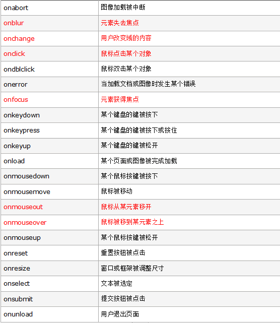
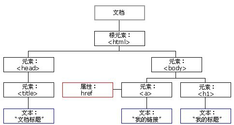

# dom元素

+  JS执行事件的步骤
  ```
  1.获取事件源

  2. 绑定事件

  3.编写事件驱动函数
  ```

+ 常见的事件
+   

+ DOM的数据结构
+ 
+ 
 ```
- HTML的组成部分为节点,在html中一切都是节点
- document 文档节点
- html标签是一个根节点
- 每一个标签是一个元素节点
- 标签中的文字时文本节点
- 标签中的属性是属性节点
- 标签中的注释是注释节点
```
+ 获取节点
  
  ```

  1.通过ID获取

   document.getElementById();
   
   2. 通过class获取节点(存在兼容问题不兼容I9以前版本)

     document.getElementsByClassName();

   3 通过标签获取节点:

      document.getElementsByTagName();

    1. 通过选择器获取单个标签(h5新方法,兼容ie8)

       document.querySelector();

    5 通过选择器获标签

       document.querySelectorAll();

  ```     

  + 获取父亲节点

```
一个节点只有一个父亲节点,语法: node.parentNode;
```
+ 获取兄弟节点

```
1. 获取上一个兄弟节点

- node.previousSibling; 
+ [在i9一下指上一个元素节点,在谷歌浏览器中指下一个任意类型的节点];

- node.previousElementSibling;
// 上一个元素节点,不兼容ie9以下

- 兼容写法 : node.previousElementSibling || node.previousSibling;
```
```
获取下一个兄弟节点

 - node.nextSibling;
// 兼容同previousSibling;

- node.nextElementSibling     
 //兼容同previousElementSibling；  

- 兼容写法: node.nextElmentSibling || node.nextSibling;

```
+ 获取子节点
  
  ```
  1.获取第一个子节点
  
       - pnode.firstChild;
     // 兼容同previousSibling

      - pnode.firstElementChild;
            
        - 兼容写法:
        pnode.firstElmentChild || pnode.firstChild;
    ```
   ```
   2. 获取最后一个子节点 :

   - pnode.lastChild;
   //兼容同上

   -pnode.lastElementChild;

   -兼容写法:
   pnode.lastElementChild || pnode.lastChild;
   ```
   ```
   3.获取所有子节点:

     - pnode.childNodes
            // 返回所有类型的子节点集合

            - pnode.children
            // 返回元素子节点,但ie9以下包含注释节点

     4. 判断节点类型, nodeType:

            - node.nodeType == 1, 表示元素节点

            - node.nodeType == 2, 表示属性节点

            - node.nodeType == 3, 表示文本节点

            - node.nodeType == 8, 表示注释节点        
      5. 兼容:

            function getChildren(pNode){

                var nodes =  pNode.children;

                var elNodes = [];

                for(var i = 0 ; i < nodes.length ; i++ ){

                    if(nodes[i].nodeTyoe == 1){

                        elNodes.push(nodes[i]);
                    }
                }

                return elNodes;
            }
    ```
+ 节点操作:
```
- 获取节点都是属性,操作节点都是函数/方法;

1. 创建节点

- document.createElement();
// 创建节点之后不会显示到页面上,要配合插入节点使用;

2. 插入子节点

- pNode.appendChild(cNode);
//按先后顺序插入