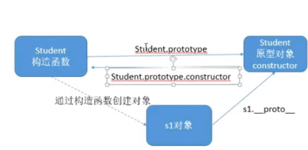

# 原型对象prototype

>   1. 当创建多个对象时,有时会创建方法,如果在构造函数中直接创建方法,则创建每个对象的时候都会为其创建一个函数对象,这样会影响程序的性能.

>   2. 我们可以通过创建全局函数,然后将该函数对象赋值给对象的方法变量,但这样会存在一些安全隐患,比如可能别的程序员做的一部分中用了该函数命名,合并的时候就会覆盖,这个时候就可以使用原型对象prototype解决.

>   3. 我们创建的每个函数,解析器都会向函数中添加一个prototype属性,这个属性存着prototype对象的地址,每个函数的原型对象地址都不同.

>   4. 当函数以构造函数创建对象时,对象中都会有一个隐式的属性指向构造函数中的原型对象,可以通过 对象.__proto__ 来访问该对象.

>   5. 原型对象就像一个公共的区域,所有同一个类型的对象都可以访问到构造函数中的原型,因此我们可以把对象中的公共内容,添加到prototype中去.
-      例: 1. SayName.prototype.a = function(){}; //给
		   2. obj.__proto__.a = function(){}; //__proto__非标准属性

>   6. 当访问对象的属性或者方法的时,会先从对象中寻找,如果没有就会对象的p原型对象中寻找,如果还没有就会向原型对象中的原型对象(Object)寻找,直到Object中的原型对象,object中的原型对象没有原型.

>   7. 使用in检查对象中有没有某属性,如果对象中没有原型中有也会返回true

>   8. 如果只想检查对象中的属性,可以使用 对象.hasOwnProperty("属性名") 来检查

>   9. 原型对象中也有原型对象,而 hasOwnProperty 就在原型对象构造函数的原型对象中. 

>   10. 原型对象中有一个属性constructor ,可以获取到当前对象的构造函数对象

>   11. 原型对象三角关系 

>   12. 原型链 